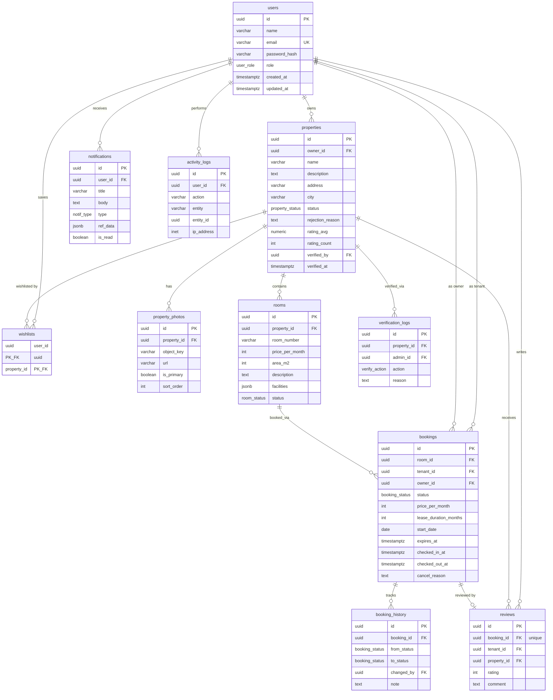

# 3. Database Design & ERD

## 3.1 ERD (Mermaid)



## 3.2 Migration — Up

File: `backend/migrations/000001_init_schema.up.sql`

```sql
BEGIN;

-- ============================================================
-- ENUMS
-- ============================================================
CREATE TYPE user_role AS ENUM ('super_admin', 'owner', 'tenant');

CREATE TYPE property_status AS ENUM (
    'draft', 'pending_verification', 'published', 'rejected', 'inactive'
);

CREATE TYPE room_status AS ENUM (
    'available', 'pending', 'survey', 'booked', 'active',
    'maintenance', 'completed'
);

CREATE TYPE booking_status AS ENUM (
    'pending', 'survey', 'booked', 'active', 'completed',
    'cancelled', 'expired', 'rejected'
);

CREATE TYPE verify_action AS ENUM ('submitted', 'approved', 'rejected');

CREATE TYPE notif_type AS ENUM ('booking', 'verification', 'review', 'system');

-- ============================================================
-- USERS
-- ============================================================
CREATE TABLE users (
    id            UUID PRIMARY KEY DEFAULT gen_random_uuid(),
    name          VARCHAR(100) NOT NULL,
    email         VARCHAR(255) NOT NULL UNIQUE,
    password_hash VARCHAR(255) NOT NULL,
    role          user_role    NOT NULL DEFAULT 'tenant',
    created_at    TIMESTAMPTZ  NOT NULL DEFAULT now(),
    updated_at    TIMESTAMPTZ  NOT NULL DEFAULT now()
);

CREATE INDEX idx_users_role ON users(role);

-- ============================================================
-- PROPERTIES
-- ============================================================
CREATE TABLE properties (
    id               UUID PRIMARY KEY DEFAULT gen_random_uuid(),
    owner_id         UUID          NOT NULL REFERENCES users(id) ON DELETE CASCADE,
    name             VARCHAR(150)  NOT NULL,
    description      TEXT,
    address          VARCHAR(500)  NOT NULL,
    city             VARCHAR(100)  NOT NULL,
    status           property_status NOT NULL DEFAULT 'draft',
    rejection_reason TEXT,
    rating_avg       NUMERIC(3,2)  NOT NULL DEFAULT 0 CHECK (rating_avg BETWEEN 0 AND 5),
    rating_count     INTEGER       NOT NULL DEFAULT 0,
    verified_by      UUID REFERENCES users(id) ON DELETE SET NULL,
    verified_at      TIMESTAMPTZ,
    created_at       TIMESTAMPTZ   NOT NULL DEFAULT now(),
    updated_at       TIMESTAMPTZ   NOT NULL DEFAULT now()
);

CREATE INDEX idx_properties_owner  ON properties(owner_id);
CREATE INDEX idx_properties_status ON properties(status);
CREATE INDEX idx_properties_city   ON properties(city);
CREATE INDEX idx_properties_listing ON properties(status, city); -- listing publik + filter kota

-- ============================================================
-- PROPERTY PHOTOS
-- ============================================================
CREATE TABLE property_photos (
    id          UUID PRIMARY KEY DEFAULT gen_random_uuid(),
    property_id UUID NOT NULL REFERENCES properties(id) ON DELETE CASCADE,
    object_key  VARCHAR(500)  NOT NULL,              -- path objek di MinIO bucket
    url         VARCHAR(1000) NOT NULL,
    is_primary  BOOLEAN NOT NULL DEFAULT false,
    sort_order  INTEGER NOT NULL DEFAULT 0,
    created_at  TIMESTAMPTZ NOT NULL DEFAULT now()
);

CREATE INDEX idx_property_photos_property ON property_photos(property_id);

-- ============================================================
-- ROOMS
-- ============================================================
CREATE TABLE rooms (
    id               UUID PRIMARY KEY DEFAULT gen_random_uuid(),
    property_id      UUID NOT NULL REFERENCES properties(id) ON DELETE CASCADE,
    room_number      VARCHAR(20) NOT NULL,
    price_per_month  INTEGER NOT NULL CHECK (price_per_month > 0),
    area_m2          INTEGER CHECK (area_m2 > 0),
    description      TEXT,
    facilities       JSONB NOT NULL DEFAULT '[]',     -- ["ac","wifi","private_bathroom"]
    status           room_status NOT NULL DEFAULT 'available',
    created_at       TIMESTAMPTZ NOT NULL DEFAULT now(),
    updated_at       TIMESTAMPTZ NOT NULL DEFAULT now(),

    CONSTRAINT uq_rooms_property_number UNIQUE (property_id, room_number)
);

CREATE INDEX idx_rooms_property ON rooms(property_id);
CREATE INDEX idx_rooms_status   ON rooms(status);
CREATE INDEX idx_rooms_price    ON rooms(price_per_month);

-- ============================================================
-- BOOKINGS
-- ============================================================
CREATE TABLE bookings (
    id                    UUID PRIMARY KEY DEFAULT gen_random_uuid(),
    room_id               UUID NOT NULL REFERENCES rooms(id),
    tenant_id             UUID NOT NULL REFERENCES users(id),
    owner_id              UUID NOT NULL REFERENCES users(id),
    status                booking_status NOT NULL DEFAULT 'pending',
    price_per_month       INTEGER NOT NULL,           -- snapshot harga saat booking
    lease_duration_months INTEGER NOT NULL CHECK (lease_duration_months BETWEEN 1 AND 36),
    start_date            DATE,                        -- diisi saat confirm/check-in
    expires_at            TIMESTAMPTZ NOT NULL,        -- now() + 72 jam saat pending
    checked_in_at         TIMESTAMPTZ,
    checked_out_at        TIMESTAMPTZ,
    cancel_reason         TEXT,
    created_at            TIMESTAMPTZ NOT NULL DEFAULT now(),
    updated_at            TIMESTAMPTZ NOT NULL DEFAULT now()
);

CREATE INDEX idx_bookings_room   ON bookings(room_id);
CREATE INDEX idx_bookings_tenant ON bookings(tenant_id);
CREATE INDEX idx_bookings_owner  ON bookings(owner_id);
CREATE INDEX idx_bookings_expiry ON bookings(status, expires_at); -- worker auto-expiry

-- Aturan #10: 1 user hanya 1 booking PENDING per kamar (DB-level, imun race condition)
CREATE UNIQUE INDEX uq_one_pending_per_room
    ON bookings(room_id, tenant_id) WHERE status = 'pending';

-- Cegah dua booking aktif menempati kamar yang sama secara bersamaan
CREATE UNIQUE INDEX uq_room_single_active
    ON bookings(room_id) WHERE status IN ('survey', 'booked', 'active');

-- ============================================================
-- BOOKING HISTORY (audit trail transisi status)
-- ============================================================
CREATE TABLE booking_history (
    id          UUID PRIMARY KEY DEFAULT gen_random_uuid(),
    booking_id  UUID NOT NULL REFERENCES bookings(id) ON DELETE CASCADE,
    from_status booking_status,
    to_status   booking_status NOT NULL,
    changed_by  UUID REFERENCES users(id) ON DELETE SET NULL,
    note        TEXT,
    created_at  TIMESTAMPTZ NOT NULL DEFAULT now()
);

CREATE INDEX idx_booking_history_booking ON booking_history(booking_id);

-- ============================================================
-- VERIFICATION LOGS
-- ============================================================
CREATE TABLE verification_logs (
    id          UUID PRIMARY KEY DEFAULT gen_random_uuid(),
    property_id UUID NOT NULL REFERENCES properties(id) ON DELETE CASCADE,
    admin_id    UUID NOT NULL REFERENCES users(id),
    action      verify_action NOT NULL,
    reason      TEXT,                                    -- wajib saat rejected (dijaga service layer)
    created_at  TIMESTAMPTZ NOT NULL DEFAULT now()
);

CREATE INDEX idx_verification_logs_property ON verification_logs(property_id);

-- ============================================================
-- REVIEWS
-- ============================================================
CREATE TABLE reviews (
    id          UUID PRIMARY KEY DEFAULT gen_random_uuid(),
    booking_id  UUID NOT NULL UNIQUE REFERENCES bookings(id) ON DELETE CASCADE,
    tenant_id   UUID NOT NULL REFERENCES users(id),
    property_id UUID NOT NULL REFERENCES properties(id) ON DELETE CASCADE,
    rating      INTEGER NOT NULL CHECK (rating BETWEEN 1 AND 5),
    comment     TEXT,
    created_at  TIMESTAMPTZ NOT NULL DEFAULT now()
);
-- Validasi "hanya booking COMPLETED boleh review" diterapkan di service layer
-- (transaksi: cek status booking -> insert review -> update agregat rating).

CREATE INDEX idx_reviews_property ON reviews(property_id);
CREATE INDEX idx_reviews_tenant   ON reviews(tenant_id);

-- ============================================================
-- WISHLISTS (many-to-many users <-> properties)
-- ============================================================
CREATE TABLE wishlists (
    user_id     UUID NOT NULL REFERENCES users(id) ON DELETE CASCADE,
    property_id UUID NOT NULL REFERENCES properties(id) ON DELETE CASCADE,
    created_at  TIMESTAMPTZ NOT NULL DEFAULT now(),
    PRIMARY KEY (user_id, property_id)
);

CREATE INDEX idx_wishlists_property ON wishlists(property_id);

-- ============================================================
-- NOTIFICATIONS
-- ============================================================
CREATE TABLE notifications (
    id         UUID PRIMARY KEY DEFAULT gen_random_uuid(),
    user_id    UUID NOT NULL REFERENCES users(id) ON DELETE CASCADE,
    title      VARCHAR(200) NOT NULL,
    body       TEXT NOT NULL,
    type       notif_type NOT NULL DEFAULT 'system',
    ref_data   JSONB,                                   -- {"booking_id": "...", "property_id": "..."}
    is_read    BOOLEAN NOT NULL DEFAULT false,
    created_at TIMESTAMPTZ NOT NULL DEFAULT now()
);

CREATE INDEX idx_notifications_user_unread ON notifications(user_id, is_read);

-- ============================================================
-- ACTIVITY LOGS
-- ============================================================
CREATE TABLE activity_logs (
    id         UUID PRIMARY KEY DEFAULT gen_random_uuid(),
    user_id    UUID REFERENCES users(id) ON DELETE SET NULL,
    action     VARCHAR(100) NOT NULL,                   -- "property.submit", "booking.approve"
    entity     VARCHAR(50)  NOT NULL,                   -- "property" | "booking" | ...
    entity_id  UUID,
    ip_address INET,
    created_at TIMESTAMPTZ NOT NULL DEFAULT now()
);

CREATE INDEX idx_activity_logs_user ON activity_logs(user_id, created_at DESC);

COMMIT;
```

## 3.3 Migration — Down

File: `backend/migrations/000001_init_schema.down.sql`

```sql
BEGIN;

DROP TABLE IF EXISTS activity_logs CASCADE;
DROP TABLE IF EXISTS notifications CASCADE;
DROP TABLE IF EXISTS wishlists CASCADE;
DROP TABLE IF EXISTS reviews CASCADE;
DROP TABLE IF EXISTS verification_logs CASCADE;
DROP TABLE IF EXISTS booking_history CASCADE;
DROP TABLE IF EXISTS bookings CASCADE;
DROP TABLE IF EXISTS rooms CASCADE;
DROP TABLE IF EXISTS property_photos CASCADE;
DROP TABLE IF EXISTS properties CASCADE;
DROP TABLE IF EXISTS users CASCADE;

DROP TYPE IF EXISTS notif_type;
DROP TYPE IF EXISTS verify_action;
DROP TYPE IF EXISTS booking_status;
DROP TYPE IF EXISTS room_status;
DROP TYPE IF EXISTS property_status;
DROP TYPE IF EXISTS user_role;

COMMIT;
```

Contoh migration berikutnya (`000002_add_phone_to_users.up.sql`) untuk membuktikan `ALTER`:

```sql
ALTER TABLE users ADD COLUMN phone VARCHAR(20);
-- down:
-- ALTER TABLE users DROP COLUMN phone;
```

## 3.4 Catatan Desain Database

| Aspek | Keputusan | Alasan |
| ----- | --------- | ------ |
| Primary key | UUID (`gen_random_uuid`) | Aman diekspos di URL; tidak membocorkan volume data |
| Enum status | PostgreSQL native enum | Integritas di level DB, bukan sekadar string di aplikasi |
| Snapshot harga | `bookings.price_per_month` | Perubahan harga kamar tidak merusak histori transaksi |
| Partial unique index | `uq_one_pending_per_room`, `uq_room_single_active` | Aturan bisnis dijaga DB-level; imun race condition concurrent request |
| Audit trail | `booking_history`, `verification_logs`, `activity_logs` | Transparansi & kebutuhan interview discussion |
| Denormalisasi rating | `properties.rating_avg/rating_count` | Listing tidak perlu JOIN+aggregate ke reviews tiap request |
| Soft vs hard delete | Property soft (`inactive`); hard delete hanya super admin | Histori booking tetap utuh |
| Index listing | `(status, city)` properties, `(status, expires_at)` bookings | Query listing publik & scan worker expiry |
| Timestamps | `TIMESTAMPTZ` selalu | Aman terhadap timezone; standar PostgreSQL |

## 3.5 Seed Data

Script `backend/scripts/seed/main.go` membuat akun demo:

| Email               | Password    | Role        |
| ------------------- | ----------- | ----------- |
| admin@kostify.test  | Admin123!   | super_admin |
| owner@kostify.test  | Owner123!   | owner       |
| tenant@kostify.test | Tenant123!  | tenant      |

Plus data contoh: 2 kost milik owner (1 `published` dengan 3 kamar + foto placeholder,
1 `draft`), agar semua halaman langsung punya isi saat demo.
